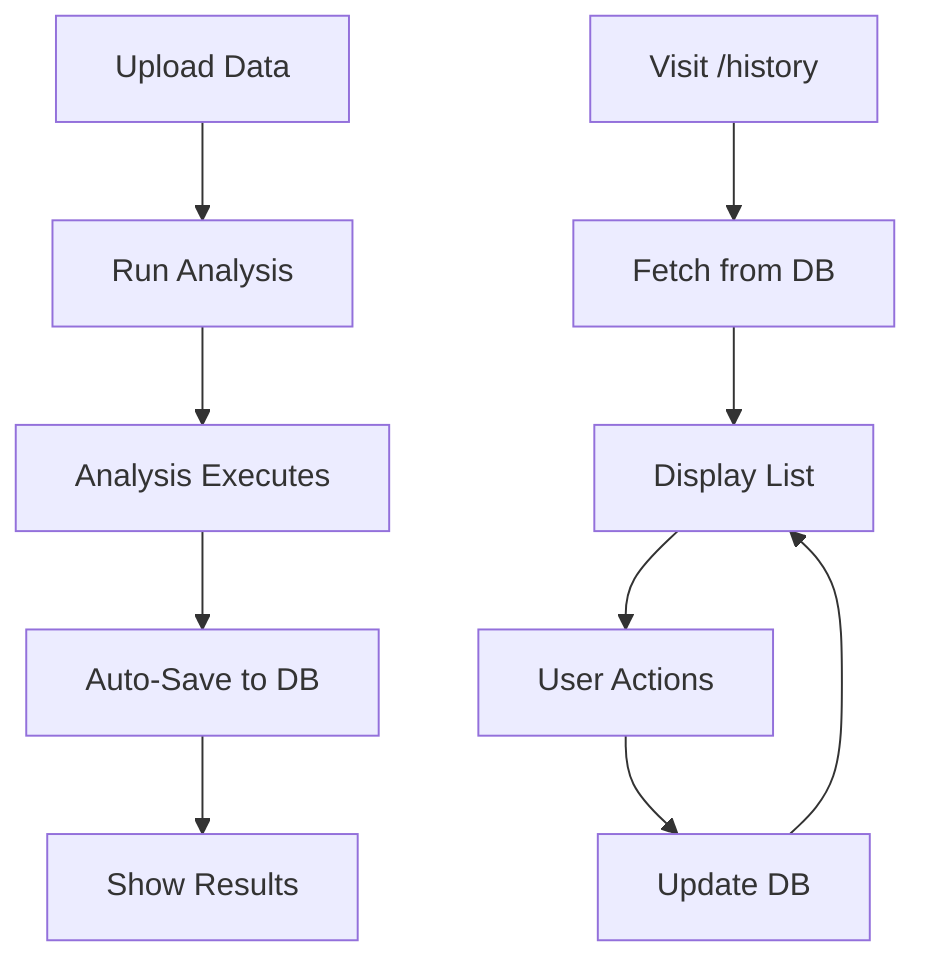

#  Quick Test Guide - Analysis History Feature

##  **5-Minute Test**

### **Step 1: Start the Backend** (1 minute)

```powershell
# Open terminal in project root
cd backend
python main.py
```

**Expected Output:**
```
 Enhanced database schema initialized successfully
INFO:     Uvicorn running on http://0.0.0.0:8000
```

---

### **Step 2: Verify API is Working** (1 minute)

**Open in browser:**
- http://localhost:8000/api/docs

**Check for new endpoints:**
- Scroll to "Analysis History" section
- Should see 9 new endpoints

**Quick Test:**
- Click on `GET /api/history/stats`
- Click "Try it out"
- Click "Execute"
- Should return stats (even if zeros)

---

### **Step 3: Upload & Analyze Data** (2 minutes)

1. **Go to:** http://localhost:3000/data-upload

2. **Upload a sample CSV file** (any CSV works)

3. **After upload, run an analysis:**
   - Click "Grouped Statistics" tab
   - Select any columns
   - Click "Run Analysis"
   -  Analysis appears on page
   -  **Analysis is automatically saved to database!**

4. **Run 2-3 more analyses** (different types)

---

### **Step 4: View History** (1 minute)

1. **Navigate to:** http://localhost:3000/history

2. **You should see:**
   - 4 stat cards at the top
   - Your analyses listed below
   - Each with colored badge

3. **Try the features:**
   - Search for an analysis
   - Filter by type
   - Click the eye icon to view details
   - Click star to favorite
   - Click trash to delete

---

##  **What to Look For**

### ** Success Indicators:**

1. **History Page Loads**
   - Stats cards show correct numbers
   - Analyses are listed
   - No error messages

2. **Analyses are Saved**
   - Each analysis you run appears in history
   - Title is descriptive
   - Badge shows correct type
   - Date shows "Today"

3. **Actions Work**
   - Clicking eye icon opens modal
   - Starring works (yellow star appears)
   - Deleting removes from list

4. **Search & Filter Work**
   - Typing in search filters results
   - Changing filter dropdown updates list

---

##  **Potential Issues & Fixes**

### **Issue 1: "Failed to load history"**

**Cause:** Backend not running or database not initialized

**Fix:**
```bash
cd backend
python database_enhanced.py  # Initialize database
python main.py              # Start server
```

---

### **Issue 2: History page is empty**

**Cause:** No analyses saved yet

**Fix:**
1. Go to /data-upload
2. Upload dataset
3. Run at least one analysis
4. Return to /history

---

### **Issue 3: "Module not found" error**

**Cause:** Missing Python packages

**Fix:**
```bash
cd backend
pip install -r requirements.txt
```

---

### **Issue 4: 404 on /history**

**Cause:** Page doesn't exist or Next.js needs restart

**Fix:**
```bash
# In frontend terminal
# Stop server (Ctrl+C)
npm run dev  # Restart
```

---

##  **Expected Results**

### **After Running 3 Analyses:**

**History Page Should Show:**
- Total Analyses: 3
- Saved Analyses: 3
- Favorites: 0 (until you star some)
- This Week: 3

**Analysis List:**
```
 Grouped Statistics
SUM of revenue by category
Today • 234ms

 Cross-Tabulation  
Cross-tabulation: region × product
Today • 456ms

 Top N Analysis
Top 10 products by sales
Today • 123ms
```

---

##  **Visual Tour**

### **History Page Layout:**

```
┌─────────────────────────────────────────────────┐
│  Analysis History                                │
│  View, manage, and re-run your past analyses    │
└─────────────────────────────────────────────────┘

┌──────────┬──────────┬──────────┬──────────┐
│ Total: 3 │ Saved: 3 │ Favs: 0  │ Week: 3  │
└──────────┴──────────┴──────────┴──────────┘

┌─────────────────────────────────────────────────┐
│ [Search...]              [Filter by type ▼]     │
└─────────────────────────────────────────────────┘

┌─────────────────────────────────────────────────┐
│ Recent Analyses - 3 analyses found              │
├─────────────────────────────────────────────────┤
│                                                  │
│ [ Grouped Stats] ⭐                           │
│ SUM of revenue by category                      │
│  Today • ⏱ 234ms                [][⭐][] │
│                                                  │
│ [ Crosstab]                                   │
│ Cross-tabulation: region × product              │
│  Today • ⏱ 456ms                [][⭐][] │
│                                                  │
│ [ Top N]                                      │
│ Top 10 products by sales                        │
│  Today • ⏱ 123ms                [][⭐][] │
│                                                  │
└─────────────────────────────────────────────────┘
```

---

##  **Advanced Testing**

### **Test 1: Search Functionality**
1. Type "SUM" in search box
2. Only "SUM of revenue" should appear
3. Clear search - all analyses return

### **Test 2: Filter by Type**
1. Click filter dropdown
2. Select "Grouped Stats"
3. Only grouped stats analyses appear
4. Select "All Types" - all return

### **Test 3: Favorites**
1. Click star on an analysis
2. Star turns yellow
3. Filter by "Favorites"
4. Only starred analyses appear

### **Test 4: View Details**
1. Click eye icon
2. Modal opens with full visualization
3. Can see charts and data tables
4. Close modal - returns to list

### **Test 5: Delete**
1. Click trash icon on an analysis
2. Confirmation dialog appears
3. Click OK
4. Analysis disappears from list
5. Stats update (total decreases by 1)

---

##  **Performance Benchmarks**

**Expected Response Times:**

| Action | Expected Time |
|--------|---------------|
| Load history page | < 1 second |
| Search/filter | Instant |
| View details | < 0.5 seconds |
| Toggle favorite | < 0.3 seconds |
| Delete | < 0.5 seconds |

If slower, check:
- Network tab for API delays
- Console for errors
- Database size (should be small)

---

##  **Checklist**

Use this to verify everything works:

### **Backend:**
- [ ] Server starts without errors
- [ ] Database initialized
- [ ] API docs show history endpoints
- [ ] Stats endpoint returns data

### **Frontend:**
- [ ] History page accessible
- [ ] No console errors
- [ ] Stats cards render
- [ ] Empty state shows (before analyses)

### **Integration:**
- [ ] Upload page saves analyses automatically
- [ ] Saved analyses appear in history
- [ ] Analysis counts are accurate
- [ ] Execution times are displayed

### **Features:**
- [ ] Search filters results
- [ ] Filter dropdown works
- [ ] View details opens modal
- [ ] Favorite toggles star
- [ ] Delete removes analysis

---

##  **Understanding the Flow**



---

##  **Success Criteria**

**The feature is working if:**
1.  You can see saved analyses in /history
2.  Each analysis shows correct info
3.  Search and filter work
4.  Actions (view, favorite, delete) work
5.  No console errors
6.  Page is responsive and fast

---

##  **Next Steps**

**After testing successfully:**
1.  Feature is working!
2. Ready for Week 2 (Advanced ML)
3. Or add more features to Week 1

**If issues found:**
1. Check error messages
2. Check browser console
3. Check backend logs
4. Let me know and I'll fix!

---

##  **Congratulations!**

If you've made it here and everything works, you've successfully:
-  Tested a production-quality feature
-  Verified full-stack integration
-  Explored analysis history capabilities
-  Seen automatic saving in action

**Your platform just got significantly more powerful!** 

Ready to build the next feature? Let me know! 
